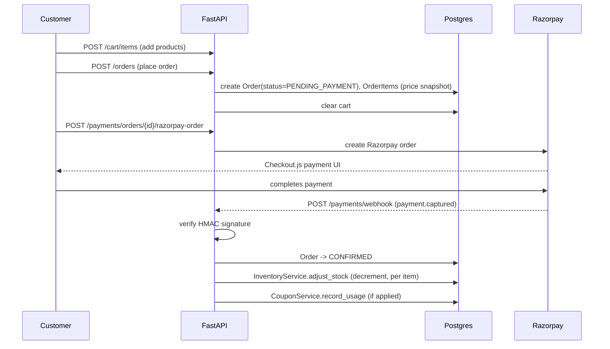

# Pure Lioraa — Backend Architecture

Enterprise-level, feature-based (vertical-slice) architecture for the Pure Lioraa
B2C beauty e-commerce platform, built on **Python 3.12 + FastAPI + PostgreSQL**,
implementing the requirements in `Pure Lioraa - Client Document.pdf`.

## 1. Why feature-based (vertical-slice), not layer-based

A layer-based backend groups code horizontally (`models/`, `views/`,
`serializers/` each holding every entity). At the scale implied by the PRD —
16 domains: auth, users, products, categories, inventory, cart, wishlist,
coupons, orders, payments, news, feedback, contact, chatbot, audit logs,
dashboard — that produces files with dozens of unrelated classes and constant
merge conflicts across teams.

Instead, each domain is a **self-contained slice** under `app/features/<name>/`
owning its own models, schemas, data access, business logic and routes. A
backend engineer can open one folder and see the whole feature; a new
developer can add a 17th feature (e.g. "loyalty points") without touching
existing ones. Cross-feature interaction happens at the **service layer only**
(e.g. `orders.service` calls `cart.service` and `inventory.service` directly) —
never by importing another feature's repository or model to bypass its rules.

## 2. Directory layout

```
backend/
├── app/
│   ├── main.py                 # FastAPI app, middleware, exception handlers
│   ├── core/                   # config, security (JWT/argon2), logging, email port
│   ├── db/
│   │   ├── base.py             # Declarative Base + naming convention (no feature imports)
│   │   ├── all_models.py       # imports every feature's models — Alembic/tests only
│   │   ├── session.py          # async engine/session, get_db dependency
│   │   └── mixins.py           # UUIDPrimaryKeyMixin, TimestampMixin
│   ├── common/                 # BaseRepository, BaseService, generic CRUD router factory
│   ├── api/v1/
│   │   ├── deps.py             # get_current_user, require_admin, get_optional_user
│   │   └── router.py           # aggregates every feature router under /api/v1
│   └── features/
│       ├── auth/                {models, schemas, repository, service, router, dependencies}
│       ├── users/                — User + Address (owns the core identity model)
│       ├── products/             — catalogue (FR-PROD)
│       ├── categories/           — FR-CAT
│       ├── inventory/            — stock ledger (FR-INV)
│       ├── cart/                 — FR-CART
│       ├── wishlist/              — FR-WISH
│       ├── coupons/              — FR-COUP
│       ├── orders/               — FR-ORDER
│       ├── payments/             — Razorpay integration (FR-PAY)
│       ├── news/                 — PG-005 / PG-A007
│       ├── feedback/             — PG-A008
│       ├── contact/              — PG-006 / PG-A009
│       ├── chatbot/              — AWS Bedrock + RAG (FR-AI-001)
│       ├── audit_logs/           — PG-A012 (write-only from other services)
│       └── dashboard/            — PG-A001 read-only aggregation
├── alembic/                     # async migrations, naming-convention aware
├── tests/                        # pytest + httpx.AsyncClient, per-feature test folders
├── pyproject.toml
├── Dockerfile
└── .env.example
```

Every feature follows the same five-file pattern:

| File | Responsibility |
|---|---|
| `models.py` | SQLAlchemy 2.0 ORM models this feature owns |
| `schemas.py` | Pydantic request/response DTOs |
| `repository.py` | Data access — subclasses `BaseRepository[Model]` |
| `service.py` | Business rules — subclasses `BaseService` or is bespoke |
| `router.py` | FastAPI `APIRouter` — thin controllers only |

## 3. Generic CRUD, without losing security nuance

`app/common/repository.py` (`BaseRepository[ModelType]`) and
`app/common/service.py` (`BaseService[Model, CreateSchema, UpdateSchema]`)
give every catalogue-style feature `get/list_all/create/update/delete` for
free. `app/common/crud_router.py`'s `build_crud_router(...)` wires those into
list/get/create/update/delete HTTP routes with per-route admin gating:

```python
router = build_crud_router(
    service_dependency=get_category_service,
    create_schema=CategoryCreate, update_schema=CategoryUpdate, read_schema=CategoryRead,
    prefix="/categories", tags=["categories"],
    require_admin_read=False,   # customers can browse
    require_admin_write=True,   # only admins mutate
)
```

This is used as-is for **categories, products, news (admin side), coupons,
feedback (admin side), contact (admin side), users (admin side)** — every
"Admin manages a catalogue, customers browse it" capability in PRD §5.

Features that are **not** shaped like generic CRUD get bespoke routers instead
of being force-fit into the factory:

- **cart** — operations are "my cart" (add/update/remove item, apply/remove
  coupon), not admin CRUD over arbitrary IDs.
- **orders** — placing an order is a checkout workflow (reads the cart, snapshots
  prices, creates `Order` + `OrderItem`), not a plain insert.
- **payments** — driven by the Razorpay flow (create order → verify signature →
  webhook), never a public create/update/delete.
- **inventory** — an **append-only audit ledger**; only list/get/create are
  exposed (no update/delete of history), and `adjust_stock()` keeps
  `Product.stock_quantity` and the ledger row atomically in sync.
- **audit_logs** — read-only for admins; `AuditLogService.record(...)` is
  called internally by other services (wired as a reference in
  `inventory.adjust_stock`; extend to orders/users/coupons admin mutations as
  they mature).
- **chatbot** — a RAG query endpoint, not a resource collection.
- **dashboard** — pure read-side aggregation across other features' tables.

## 4. Data model highlights

- **UUID primary keys** (`UUIDPrimaryKeyMixin`) everywhere — non-guessable,
  safe to generate client-side, merge-friendly across environments.
- **`TimestampMixin`** (`created_at`/`updated_at`) on every table.
- **Explicit constraint naming convention** (`app/db/base.py`) so Alembic
  autogenerate produces stable, diffable migrations instead of
  driver-generated constraint names.
- **`Product.stock_quantity`** is a denormalized current count; every change
  goes through `InventoryService.adjust_stock`, which writes an
  `InventoryAdjustment` row (`previous_stock`/`new_stock`/`reason`) in the same
  transaction — the PRD's worked example (25 → −2 → 23) is exactly this flow.
- **Order pricing is snapshotted**: `CartItem.unit_price_snapshot` and
  `OrderItem.unit_price_snapshot`/`product_name_snapshot` freeze the price and
  name at the moment of action, so a later price change or rename never
  rewrites history on past carts/orders.
- **Stock is only committed on payment success** (see §6) — `place_order`
  creates the order as `PENDING_PAYMENT` without touching stock; only
  `PaymentService.confirm_payment` decrements it. An abandoned checkout never
  locks inventory.

## 5. Auth & security (PRD §10)

- **Argon2** password hashing (`app/core/security.py`) — the current
  recommended default over bcrypt/PBKDF2.
- **JWT access + refresh tokens** (PyJWT). Refresh tokens are tracked in a
  `refresh_tokens` table by `jti` so they can be **revoked** (logout, password
  reset) — a bare stateless JWT can't do this.
- **Password reset** tokens are single-use (`password_reset_tokens.used_at`)
  and revoke all of the user's refresh tokens on success.
- **Role-based access**: `app/api/v1/deps.py` exposes `get_current_user`,
  `require_admin`, and `get_optional_user` (for guest-usable routes like the
  chatbot and the public contact form).
- Admin vs. customer separation is enforced **per-route** via FastAPI
  `dependencies=[Depends(require_admin)]`, not by a separate app/process —
  simpler to operate, same security boundary.
- Razorpay webhook and client-verify paths both check the **HMAC signature**
  (`RazorpayClient.verify_signature` / `verify_webhook_signature`) before
  trusting any payment confirmation.

## 6. Order → Payment lifecycle



This ordering (stock only decremented on confirmed payment) is the one
material design decision **not explicitly specified** in the PRD — §7/§15 flag
order-status workflow as "to be confirmed with client." It's the safer
default; revisit once the client confirms COD support (§15), since a
COD/no-payment order needs a different confirmation trigger than a webhook.

## 7. AI Chatbot & RAG (FR-AI-001)

- **Storage**: `chatbot.KnowledgeChunk` (product descriptions, FAQs,
  company content) with a `pgvector` `Vector(1024)` column — embeddings live
  in the *same* Postgres database as everything else. No separate vector DB
  (Pinecone/OpenSearch) is needed at this scale, which keeps the ops surface
  small; migrate to a dedicated vector store later only if corpus size or
  query latency demands it.
- **Embedding + generation**: `chatbot/bedrock_client.py` wraps AWS Bedrock —
  `invoke_model` with Titan Text Embeddings V2 for embedding, and the
  **Converse API** (`bedrock-runtime.converse`) for generation, since Converse
  is uniform across Nova Lite/Micro and any future model swap, and is where
  Bedrock **Guardrails** attach (`guardrailConfig`).
- **Retrieval**: `KnowledgeChunkRepository.similarity_search` does a cosine-
  distance nearest-neighbour query (`embedding.cosine_distance(...)`) —
  requires an `ivfflat`/`hnsw` index in production for recall at scale (add
  once corpus size is known; noted as a TODO in the repository).
- **Guardrails against the PRD's explicit risks** (unsafe responses, medical
  claims, hallucinated products): the system prompt in `bedrock_client.py`
  hard-instructs the model to recommend only catalogue products present in
  the retrieved context and to decline medical claims; `BEDROCK_GUARDRAIL_ID`
  wires in an actual Bedrock Guardrail once one is configured in AWS.
- **Sessions**: guests and logged-in customers share the same `/chatbot/query`
  endpoint (`get_optional_user`); a `ChatSession` is user-scoped only when a
  user is authenticated, so guest chat still works per the PRD's example
  interaction.

## 8. Technology mapping (PRD §9)

| PRD requirement | Implementation |
|---|---|
| Backend: FastAPI | ✅ `app/main.py`, async throughout |
| AI/LLM + RAG: AWS Bedrock | ✅ `features/chatbot/bedrock_client.py`, pgvector for retrieval |
| Payment: Razorpay | ✅ `features/payments/razorpay_client.py` (plain httpx, no extra SDK) |
| Authentication: JWT | ✅ `core/security.py` |
| AI Safety: Bedrock Guardrails | ✅ wired via `BEDROCK_GUARDRAIL_ID`/`_VERSION` |
| Containerisation: Docker | ✅ multi-stage `Dockerfile` (uv install → gunicorn+uvicorn workers) |
| CI/CD | ✅ `.github/workflows/backend-ci.yml` (ruff, mypy, alembic, pytest w/ Postgres+pgvector service) |
| Testing: Playwright + API/Backend | ✅ pytest + httpx `AsyncClient` scaffolded; Playwright is a frontend-repo concern |
| Application Monitoring: CloudWatch | Structured JSON logs (`structlog`) — ship container stdout to CloudWatch via the standard ECS/EKS log driver |
| AI Monitoring/Tracing: LangSmith | `LANGSMITH_API_KEY`/`LANGSMITH_PROJECT` reserved in config; instrument `bedrock_client.py` calls once the account is provisioned |

Database is **PostgreSQL** (not in the PRD's own table, but specified in this
task) via the `pgvector/pgvector:pg16` image, which doubles as the RAG vector
store — see §7.

## 9. What's deliberately left as TODO

Matching PRD §15 ("Items to finalise with client"), several call sites are
marked `# TODO` rather than guessed at, because the client hasn't confirmed
them yet:

- Shipping-charge and tax/GST calculation (`orders.service.place_order`)
- COD support and its effect on the payment/order-status flow
- Order cancellation/refund rules and the full admin order-status transition
  table (`orders.service.update_status`)
- Product search/filtering UX beyond by-category listing
- Email/SMS notification content and triggers (`core/email.py` is a stub port)
- Product reviews/ratings (no schema yet — not in PRD scope list either)

## 10. Local development

```bash
cp backend/.env.example backend/.env   # fill in Razorpay/AWS credentials as available
make up                                 # docker compose: postgres+pgvector, redis, backend
make migrate                            # alembic upgrade head
make test                               # pytest inside the backend
```

See the root `README.md` for the full command reference.
